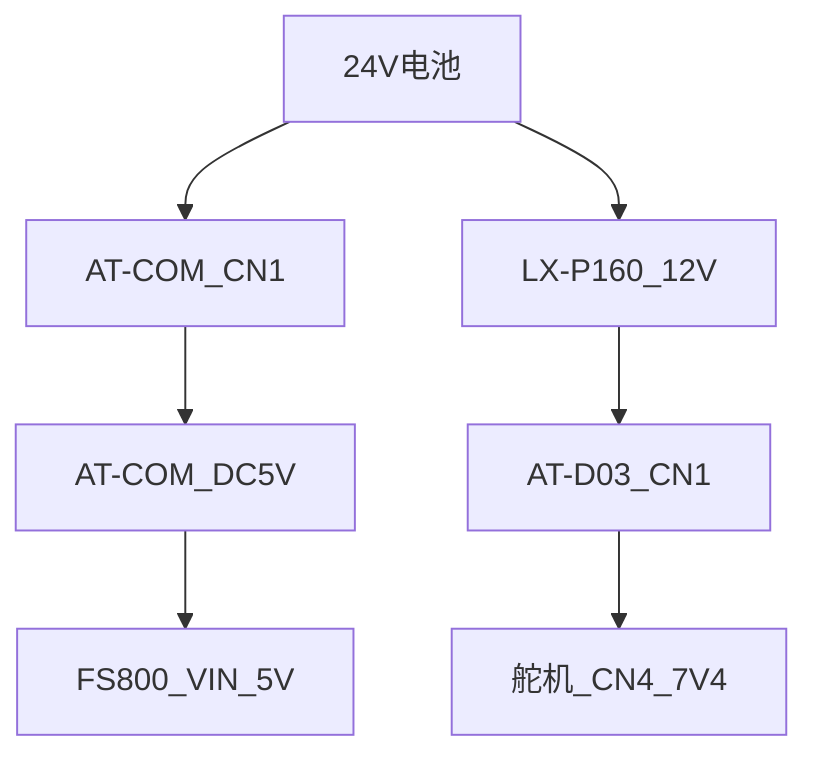
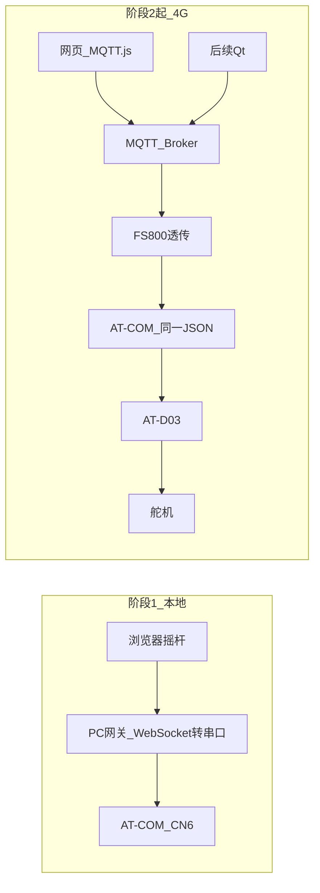

# FS800-4G 遥控与网页用户端方案

用现在手上的五件套，把「电脑串口助手发 JSON」升级成「网页下发同一套 JSON」，船上经 4G 到达舵机。  
**代码：** 阶段 1 网页与网关在 `ground-web/`；阶段 2 用同一网页加 `--mqtt`。固件暂不改。

**供电一句话：这块 FS800-A2M1 小板的 `VIN` 接 5 V，不要接 LX-P160 的 12 V。** 12 V 是大号核心板 `FS-MCore-F8A2M1` 的接法，不是你手上这片 7 焊盘绿板。

| 文档 | 管什么 |
|---|---|
| [AT-COM与AT-D03马达驱动实现.md](../motor-shixian/AT-COM与AT-D03马达驱动实现.md) | 板间 RS485、PWM、现有 JSON（已实现） |
| [无人船传感器选型与控制方案.md](无人船传感器选型与控制方案.md) | 整船长期架构（MAVLink、双 4G、视频）；**本期不按其采购** |
| **本文** | 现有硬件如何接 FS800、用 MQTT 遥控、先做本地网页 |

约束：不引入数传电台、第二块 4G、摄像头、新 MCU。电脑只做地面站/调试，不算船上设备。

---

## 1. 现有五件套与目标

### 1.1 船上硬件

| 件 | 型号/形态 | 职责 |
|---|---|---|
| AT-COM | STM32F405RGT6 | 收 JSON，混控 `左=T−Y、右=T+Y`，经 RS485 发给 D03 |
| AT-D03 | STM32G030F6 | 收二进制速度帧，PWM 驱两路舵机 |
| 舵机 | 接 D03 CN4 | SIG + 板上 7.4 V 电源 |
| 4G 模组 | **FS800-A2M1 小板 V1.0**（飞思创，IMEI `863817070589729`） | MQTT 透传：云端 JSON ↔ UART；**`VIN` 接 5 V，禁止 12 V** |
| 降压 | **LX-P160** | 24 V → 12 V，供给 **AT-D03 CN1**；**不要接到 FS800 的 VIN** |

### 1.2 三期目标

| 期 | 做什么 | 船上硬件 |
|---|---|---|
| **阶段 1** | 本机网页 + 串口网关，先把摇杆/定速 UI 和 JSON 跑通 | 可不接 4G |
| **阶段 2** | 同一网页改连 MQTT；FS800 透传入 AT-COM CN6 | 五件套全上 |
| **阶段 3** | 网页上公网 HTTPS/WSS；Qt 小屏订阅同一主题 | **不新增船上硬件** |

操控语义与现在串口助手一致：

- 急停 → `{"mode":"stop"}`
- 加速/减速、定速巡航 → `{"mode":"speed","T":20}`（`Y` 缺省 0）
- 遥控转向 → `{"mode":"speed","T":20,"Y":8}`

---

## 2. 供电树

### 2.0 这块 FS800-A2M1 接 5 V，不要接 12 V

你手上的是 **7 焊盘小板**（`DTR STA PEN RX TX GND VIN`），不是带宽压 DC-DC 的大号核心板 `FS-MCore-F8A2M1`。

| 形态 | VIN 范围 | 是不是你这块 |
|---|---|---|
| FS800-A2M1 小板（YunDTU / EzDTU） | **3.3 V 或 5 V**（厂商开箱文档按 USB-TTL 的 3.3/5 V 供电） | **是** |
| FS-MCore-F8A2M1 核心板 | 5～16 V，手册常推荐 12 V | 否 |

结论：

- **装船：`VIN` 接 5 V。** 优先用 AT-COM 板上 TPS54302 降出来的 **DC5V**（电流比 MCU 的 3.3 V 引脚大得多）。
- **实验室配参：USB-TTL 的 5 V → `VIN`。** 3.3 V 只适合短时调试，4G 发射脉冲容易把 3.3 V 拉垮。
- **禁止把 LX-P160 的 12 V 接到 `VIN`。** 小板内部是给 3.8 V 模组供电的小稳压，12 V 会过压发热直至烧毁。
- **12 V 也禁止接到 `RX` / `TX`。** UART 是 3.3 V TTL。

LX-P160 的 12 V **只给 AT-D03 CN1**，不是这块 4G 板的电源。

### 2.1 整船供电

AT-COM CN1 的 TPS54302 输入大约 **4.5～28 V**，24 V 电池直供 AT-COM。  
AT-D03 的 TPS54531 输入大约 **3.5～28 V**，**CN1 接 LX-P160 的 12 V**，不要把 24 V 直接进 D03。舵机电源**必须**走 D03 板上的 7.4 V，**不要把 12 V 接到舵机信号座**。

```
24V 电池
 ├─ AT-COM CN1（丝印 DC24V / GND）
 │      └─ 板上 DC5V ──→ FS800 VIN
 │      └─ UART4 CN6 ──→ FS800 RX/TX（交叉）
 └─ LX-P160 输入 24V → 输出 12V
        └─ AT-D03 CN1（VCC / GND）──板上降压── CN4 7.4V1 / 7.4V2 → 左右舵机
GND：电池、两块板、模组全部共地
```



### 2.2 必须遵守

- **全部 GND 共地。**
- AT-COM 的 24 V **不要**接到 D03 的 CN2。CN2 是 RS485 信号座，不是电源口。
- 4G 发射峰值电流大（按 **5 V / 1～2 A 脉冲** 留余量）。**不要从 F405 的 3.3 V 引脚给模组供电。**
- 在 `VIN` 附近并一颗 **220 µF 以上** 电解（耐压 ≥10 V），吸收发射脉冲。
- 部分市售 P160 要输入 ≥30 V 才有 12 V 输出。上电前先空载量 LX-P160 是否稳定约 12 V，再接 AT-D03 CN1。

### 2.3 4G 与 AT-COM 共 DC5V：可能把 MCU 拉重启

LTE 发射脉冲按 **5 V / 1～2 A** 估。AT-COM 的 TPS54302 额定约 3 A，理论上够，但和 F405 **共一根 5 V** 时，发射瞬间可能把电压拉塌，表现为：一注网/一发 MQTT，舵机停、AT-COM 自己复位。

处理：

1. 合练先共用 DC5V，`VIN` 旁保留 **220 µF**。
2. 若出现上述复位，**不要继续共用 DC5V**。改成：LX-P160 的 12 V → **独立 5 V 降压模块** → FS800 `VIN`（现有五件套没有这颗模块，列入第 12 节「可能要加的一件」）。独立 5 V 的 GND 仍与电池共地。
3. 仍然禁止 12 V 直进 `VIN`。

---

## 3. FS800 引脚与 AT-COM CN6 接线

### 3.1 模组焊盘（实物，从左到右）

`DTR` · `STA` · `PEN` · `RX` · `TX` · `GND` · `VIN`

| 脚 | 装船 | 说明 |
|---|---|---|
| VIN | **5 V**（AT-COM DC5V 或 USB-TTL 5 V） | **禁止 12 V** |
| GND | 共地 | 电源地与 UART 地同一点 |
| RX | AT-COM **TX** | 模组收 MCU 发出的字符 |
| TX | AT-COM **RX** | 模组把云端指令送给 MCU |
| PEN | 先悬空试上电；若完全没反应，按手册拉高 | 有的批次悬空不开机 |
| STA | 可选，接到指示灯/示波器 | 联网/工作状态 |
| DTR | **不接** | 本期不用 |
| LTE | 弹簧天线或 IPEX 天线 **必须接牢再上电** | 没天线容易注网失败 |
| GNSS | 空焊 | 本期不用 |

UART 是 **3.3 V TTL**。TX/RX **必须交叉**，接反则串口助手/MCU 完全收不到数据。

### 3.2 接到 AT-COM

AT-COM **CN6** 是 4 针 `ZX-XH2.54`，UART4，`PA0 = TX`，`PA1 = RX`，115200 8N1。现有固件只从这一路解析 JSON。针脚以**板丝印**为准，不要凭颜色猜。

| AT-COM | FS800 | 说明 |
|---|---|---|
| CN6 丝印 TX（PA0） | RX | MCU → 模组 |
| CN6 丝印 RX（PA1） | TX | 模组 → MCU |
| CN6 丝印 GND | GND | 共地 |
| 原理图 **H3 等引出的 DC5V**（TPS54302 输出） | VIN | 万用表量到约 **5 V** 再接；VIN 旁加 220 µF |
| CN6 上若引出 3.3 V | **不要接到 VIN** | 电流不够 |

不要走 CN2～CN5 的 RS485。那些口是 485 电平，不是 TTL。

**禁止接错：**

| 不要这样做 | 后果 |
|---|---|
| 24 V 接到 FS800 任何脚 | 烧毁 |
| LX-P160 的 12 V 接到 `VIN` / `RX` / `TX` / CN6 | 烧毁或电平损坏 |
| 12 V 接到舵机 SIG | 不是舵机电源；舵机只走 D03 CN4 的 7.4 V |
| USB-TTL 与 FS800 **同时**插在 CN6 | 抢总线，两边都乱 |

### 3.2.1 CN6 被 4G 占用后怎么调试

USB-TTL 和 FS800 **不能同时占 CN6**。

- 配 MQTT 参数：只接 USB-TTL。
- 合练遥控：拔掉 USB-TTL，改接 FS800。
- 舵机不听指令：先拔模组，USB-TTL + 串口助手恢复第 4 节的 JSON，确认马达链路仍好，再查 4G/Broker。
- 可选后续（**本期不做**）：打开 UART5（PC12/PD2）做第二路，CN6 留给电脑。

### 3.3 实验室单独配置模组

装船前用 USB-TTL + 飞思创 `SerialPort_To_Network_ConfigTools` 配 MQTT：

| USB-TTL | FS800 |
|---|---|
| TXD | RX |
| RXD | TX |
| GND | GND |
| **5 V**（推荐）或 3.3 V（仅短时） | VIN |

配完、确认能连上 Broker 后，再把 TX/RX/GND 改接到 AT-COM CN6，`VIN` 改接到 AT-COM **DC5V**。仍然不要接 LX-P160 的 12 V。

---

## 4. 现状：JSON 与 RS485 原样复用

当前工程名 `at-com` **不是** 4G AT 透传固件，而是 F405 遥控主机。

```
（现在）电脑串口助手 JSON
        │  USB-TTL → CN6 UART4
        ▼
AT-COM  解析 mode / T / Y
        左 = T − Y，右 = T + Y，限幅 ±1000（内部 0.1%）
        每 100 ms 组 RS485 帧
        │  CN2 A0/B0 → D03 CN2 A/B
        ▼
AT-D03  PWM → 左右舵机
```

阶段 2 之后，只把「谁往 UART4 送 JSON」换成 FS800，解析与混控不改。

### 4.1 地面 JSON（固件已实现）

源码：`at-com/Core/Src/com_host.c`。从 `{` 收到 `}` 为一包；`T`/`Y` 为百分数 −100～+100，内部 ×10。

```json
{"mode":"stop"}
{"mode":"speed","T":20}
{"mode":"speed","T":20,"Y":8}
{"mode":"speed","T":-10}
```

| 字段 | 必填 | 含义 |
|---|---|---|
| `mode` | 是 | `stop` 或 `speed` |
| `T` | `speed` 时必填 | 推进，百分数 |
| `Y` | 否，缺省 0 | 差速转向，百分数 |

MCU 应答（仍从 UART4 打回，经模组发到 MQTT）：

```
OK T=200 Y=0
```

内部单位是 0.1%，所以 JSON 里 `T:20` 对应应答 `T=200`。

**超过约 5200 ms 没有合法 JSON → 停车。** 地面必须 **2～5 Hz 续发** 当前 T/Y（串口助手调试建议 500 ms 定时发送）。

### 4.2 板间帧（网页看不见，但联调要知道）

AT-COM → AT-D03，115200：`AA 55 06 01 LEFT_BE RIGHT_BE XOR`。  
定速 20%：`AA 55 06 01 00 C8 00 C8 0F`。停车：`AA 55 06 01 00 00 00 00 07`。细节见马达驱动文档。

---

## 5. 协议选型：用 MQTT，载荷继续用现有 JSON

船在运营商 NAT 后面，没有公网 IP，必须有一个公网（或内网穿透后的）Broker 做中转。这就是 MQTT 的典型用法。

| 方案 | 结论 |
|---|---|
| **MQTT（推荐）** | 网页用 MQTT.js（WebSocket），以后 Qt 用 Qt MQTT，**同一套主题**。QoS 1。Last Will 能配再配。载荷仍是 `{mode,T,Y}`，MCU 不用改解析。 |
| 裸 TCP 透传 | 能通，但要自己做多客户端、心跳、网页还要再套一层。不作为主链路。 |
| UDP | 延迟略好，丢包无确认，和现有「超时停车」不合，遥控还得另做序号。 |
| HTTP | 一问一答，不适合 2～10 Hz 摇杆。 |
| MCU 逐条 `AT+MQTT` | FS800 已有 YunDTU 透传，F405 应把精力留在混控和 5.2 s 超时。 |
| MAVLink | 写在整船长期方案里，留给导航/航线。本期两路舵机差速不值得先换协议。 |

应用层安全仍用现有机制：地面续发 + 船端 5.2 s 无包停车。后续若要防乱序，可在 JSON 里加 `seq`（扩展，不强改本期固件）。

---

## 6. 架构与主题约定



### 6.1 Broker（阶段 2 起：4G 访问不到你电脑）

默认 **自建 Mosquitto 或 EMQX**。

阶段 1 网页走本机串口网关，**不需要** Broker。

阶段 2 一起 FS800，模组走运营商公网，**不能访问** 电脑上的 `127.0.0.1` 或 `192.168.x`。本机 Mosquitto 只给浏览器用时，4G 仍然连不上它。必须三选一：

| 做法 | 适用 | 说明 |
|---|---|---|
| 轻量云上一台 Mosquitto（**推荐装船**） | 阶段 2～3 | 公网 IP；模组连 **1883**（TCP），网页连 **9001** WebSocket；以后再上 TLS/8883 |
| 本机 Mosquitto + 内网穿透（cpolar / frp） | 仅实验室 | 穿透出的域名填进 FS800；不稳定，不要当出船方案 |
| 配置工具把模组指到已有公网 Broker，网页也连同一台 | 已有云 Broker 时 | 船和网页必须同一台、同一套主题 |

物联网卡有的会封 **1883**。连不上时把 Broker 改到 **8883** 或自定义端口（例如 11883），防火墙放行，再在模组里改端口。

阿里云 / OneNET：FS800 配置工具可以填，但自定义摇杆 JSON 和网页权限更别扭，**不作默认**。

4G 模组连的是 Broker 的 **TCP 1883/8883**；浏览器连的是 **WebSocket（本机 ws / 公网 wss）**。这是两条入口，不是两种协议。

### 6.2 主题（写死）

把 `{id}` 换成船号，例如 `boat01`。

| 主题 | 方向 | 内容 |
|---|---|---|
| `boat/{id}/cmd` | 地面 → 船 | 一行 JSON，与串口助手相同 |
| `boat/{id}/ack` | 船 → 地面 | MCU 的 `OK T=... Y=...` |
| `boat/{id}/telem` | 船 → 地面 | 后期：T/Y、是否超时停车、4G 状态 |
| `boat/{id}/lwt` | Broker → 地面 | Last Will，模组掉线显示离线 |

FS800 配置：

- **订阅** `boat/{id}/cmd`（云端下行进串口，进 UART4）
- **发布** `boat/{id}/ack`（串口上 MCU 的 OK 打到云端）  
  若工具只支持「单发布主题」，先把 ack 发到 `cmd` 的对端主题；网页同时订 `ack`。

QoS 用 **1**。KeepAlive 60 s 量级即可，**不能替代** 应用层 2～5 Hz 续发：KeepAlive 只保 MQTT 会话，船端停车看的是有没有 JSON。

### 6.3 MQTT 危险默认值（必须按这个配）

| 项 | 规定 | 不做会怎样 |
|---|---|---|
| **Retain** | **全部关掉**（发布 `cmd` 时 retain=false；Broker 不要保留该主题） | 模组重连后吃到一条旧的 `speed`，船会自己动 |
| **ClientID** | 船、网页、MQTTX **三个都不同**，例如 `boat01-fs800`、`boat01-web`、`boat01-mqttx` | 后上线的会把先上线的踢掉，遥控突然断 |
| **操控页** | 阶段 1～2 **只开一个** 网页发 `cmd` | 两个标签页抢舵 |
| **Last Will** | 配置工具若支持，再填 `boat/{id}/lwt`；**不支持就不要强配** | 掉线显示可以没有；安全底线仍是船端 5.2 s 无 JSON 停车 + 网页看 ack 超时 |

载荷只发单行：`{"mode":"speed","T":20,"Y":0}`，不要 pretty-print（解析器见到第一个 `}` 就截断）。

---

## 7. FS800 DTU 配置要点

模组出厂 YunDTU，用飞思创配置工具填表，**不必**在 F405 里发 AT。`+++` 进 AT 只作排障。

### 7.1 SIM、天线、PEN、波特率

- SIM 在小板背面或弹托，按丝印方向插入。无卡则阶段 2 无法注网。
- 优先 **4G 物联网卡**，向卡商要 APN，并确认 **不封 MQTT 端口**（1883/8883）。手机卡也能试，APN 仍按运营商。
- **先扣紧 LTE 天线再上电**（弹簧天线或 IPEX）。GNSS 空焊，不管。
- 出厂串口常见 **9600**。必须在配置工具里改成与 UART4 一致的 **115200 8N1**，否则透传乱码，MCU 解不出 JSON。
- `PEN`：先悬空；完全没反应再按手册拉高。`STA` 可看联网，`DTR` 不接。

### 7.2 配参顺序

1. 插卡，天线扣紧，USB-TTL 交叉接线，**5 V → VIN**。
2. 打开 `SerialPort_To_Network_ConfigTools`，同步模组信息。
3. 通道 1 选 **MQTT**。填 **公网可达** 的 Broker 地址（不要填 `127.0.0.1`）、端口、**唯一** ClientID、用户名、密码、KeepAlive、订阅 `boat/{id}/cmd`、发布 `boat/{id}/ack`。Retain 关。
4. 能关「状态信息打到串口」就关掉（见 7.3）。
5. 写参并复位，等到类似 `FS@MQTT CONNECTED:1`。
6. 用 MQTTX（另一个 ClientID）向 `cmd` 发 `{"mode":"stop"}`，USB-TTL 串口应看到同一串字符。
7. 再把 TX/RX/GND 改接到 AT-COM CN6，`VIN` 改 AT-COM **DC5V**（若复位则改独立 5 V，见 2.3）。

### 7.3 DTU 状态串与 JSON 挤在同一 UART

模组可能主动打印 `FS@MQTT CONNECTED:1` 一类非 JSON。现有 `com_host.c` 会丢掉不是 `{` 开头的字节，一般无害。仍建议：

- 配置工具里尽量关掉「状态上报到串口」，避免和 JSON 粘在一起。
- 下行只发**单行紧凑 JSON**，不要多行 pretty-print。
- MCU 回的是 `OK T=200 Y=0`，**不是 JSON**。网页按纯文本显示最近一条即可，不要当 JSON 去 parse。

---

## 8. 阶段 1：本地网页用户端

浏览器不能直接打开 COM 口，所以本机要有一个很薄的网关。

```
浏览器（摇杆 / 滑条）
    │  WebSocket  ws://127.0.0.1:...
    ▼
PC 网关（Python FastAPI 或 Node）
    │  打开 AT-COM 的 USB-TTL 串口 115200
    ▼
AT-COM UART4 → 现有固件
```

### 8.1 界面最少要有

- **急停**（大红键）：立刻发 `{"mode":"stop"}`，并停止速度续发。
- **T**：加减按钮 + 滑条；显示当前设定百分数。定速 = 设好 T 后 `Y=0` 持续发。
- **Y**：滑条或虚拟摇杆，差速转向。
- 连接状态、最近一次 MCU 应答（`OK T= Y=`）。
- 后台 **2～5 Hz** 把当前 `T/Y` 编码成 JSON 发出去；松杆时 T、Y 归零后**仍要低频发送**，避免「最后一包油门一直保持」。
- **只开一个操控页。** Chrome 会把后台页的定时器降得很慢，船会因 5.2 s 无包停车。操控时页面保持前台；**急停按钮点击立即发送**，不依赖定时器。

阶段 1 用 `localhost` 即可，不必证书、不必打包进小屏。Broker 可以不装。  
分步与代码：[阶段1-本地网页用户端.md](阶段1-本地网页用户端.md)，目录 `ground-web/`。

### 8.2 和阶段 2 的关系

网页控件与 JSON **不变**。阶段 2 启动 `python server.py --mqtt`，网关把 `publish cmd` 发到 Broker，不再直接打开 COM。FS800 或实验室 `mqtt_bridge.py` 负责落到 UART4。不要填电脑局域网地址给 4G 模组。分步见 [阶段2-MQTT遥控.md](阶段2-MQTT遥控.md)。

---

## 9. 装船联调与验收

1. **电源**：24 V → AT-COM CN1；24 V → LX-P160 → **12 V → AT-D03 CN1**。万用表确认 AT-COM **DC5V ≈ 5 V**（H3 等丝印）、D03 输入约 **12 V** 后，再接 FS800 `VIN` 和舵机。
2. **马达链路**（可先不接 4G）：电脑串口助手 → CN6，发 `{"mode":"speed","T":10}`，舵机应转；超过 5 s 停发应停车。
3. **模组单独**：USB-TTL **5 V** 配 MQTT（Broker 必须公网可达，见 6.1），MQTTX 用另一个 ClientID 收发 JSON。Retain 关闭。
4. **合练**：拔掉 USB-TTL，FS800 接 CN6 + **VIN 5 V**；网页或 MQTTX 发速度包；看 `ack` 文本；拔天线或断 Broker，约 5.2 s 应停车。若 AT-COM 复位，改独立 5 V（2.3）。
5. **转向**：`Y` 正负对应左右差速，若船体转反，只在地面取反 `Y` 或按马达文档对通道取反，不要改 MQTT 主题。
6. **共地与天线**：船体金属件上天线远离电机线；IPEX 垂直插拔。出问题先拔模组，CN6 改回串口助手。

### 9.1 验收清单

| 项 | 通过标准 |
|---|---|
| 续发 | 2～5 Hz 发 `speed`，舵机随 T/Y 变 |
| 停发 | 地面停发约 5.2 s，舵机停 |
| 断网 | 拔天线或停 Broker，同样约 5.2 s 停车 |
| 急停 | 点急停立刻停，不靠定时器 |
| Retain | 曾发过 `speed` 后断开再上电，**不应**自己加速 |
| ClientID | 网页与模组同时在线，互不踢掉 |
| 共 5 V | 注网过程 MCU 不复位；若复位则改独立 5 V |

---

## 10. 阶段 3：Qt 小屏与公网网页

船上硬件不变，只增加地面端。

| 端 | 用法 |
|---|---|
| 本地/公网网页 | 远程监控、多终端；部署 Nginx + Let’s Encrypt，浏览器走 **WSS** 上 Broker。1883 不要裸露公网。 |
| Qt | 嵌入式 Linux / 小屏更合适：离线、延迟、触摸。订阅同一 `boat/{id}/cmd|ack`。不要把网页再套一层壳塞进小屏。 |

公网最低鉴权：MQTT 用户名密码 + TLS；每船一个 `{id}`。单操作员互斥锁可以后做。阶段 3 起 1883 不要裸露公网，浏览器走 **WSS**。

---

## 11. 安全，以及和整船方案的边界

### 11.1 遥控安全（本期就要遵守）

- 急停：`{"mode":"stop"}` + 停止续发。
- 失联：船端 5.2 s 无合法 JSON 停车（已实现）。
- 松杆：T/Y 归零后继续发，不要静默。
- 定速：设 T、Y=0，2～5 Hz 续发。
- 转向：只改 Y，混控仍在 AT-COM。
- 限幅：JSON 百分数已在固件里钳到 ±100。
- 模组供电：只给 `VIN` **5 V**；12 V 不进模组、不进 UART。
- MQTT：Retain 关；ClientID 唯一；只开一个操控页（见 6.3）。

### 11.2 本期明确不做

- 图传、RTK/NTRIP、航线、定点 DP、第二路 4G、数传电台。
- 视频若以后要加，必须走独立通道，**不能和 cmd 主题挤在一起**（与整船方案第 6 章一致）。

### 11.3 和 MAVLink 长期方案的关系

整船文档建议控制面用 MAVLink v2。那是导航、航线、多传感器齐了之后的事。  
**当前固件已经是 JSON `T/Y` + RS485 速度帧。** 4G 只负责把这包 JSON 搬到 UART4。以后若改 MAVLink，换的是载荷和 AT-COM 解析，MQTT 主题与供电接线可以留着。

---

## 12. 材料清单

### 12.1 船上已有（本文只围绕这些）

AT-COM、AT-D03、舵机、FS800-A2M1 小板、LX-P160。

### 12.2 实验室还要准备（不算新船上控制器）

| 件 | 用途 |
|---|---|
| USB-TTL | 配 FS800、阶段 1 网关/串口助手；与模组不能同时占 CN6 |
| 4G 物联网卡 | 阶段 2 注网；确认不封 MQTT 端口 |
| MQTTX 或同类客户端 | 配参时发 `cmd`、看 `ack` |
| 公网 Broker 或内网穿透 | 阶段 2 起 FS800 才能连上（见 6.1） |
| 220 µF / ≥10 V 电解 | 并在 FS800 `VIN` 旁 |

### 12.3 可能要加的一件

| 件 | 何时才买 |
|---|---|
| 12 V → 5 V 独立降压模块（≥2 A） | 合练时 4G 与 AT-COM 共 DC5V 导致 MCU 复位（见 2.3） |

本期文档不写网页/网关源码、不写 Qt 工程、不写证书申请逐步截图。
